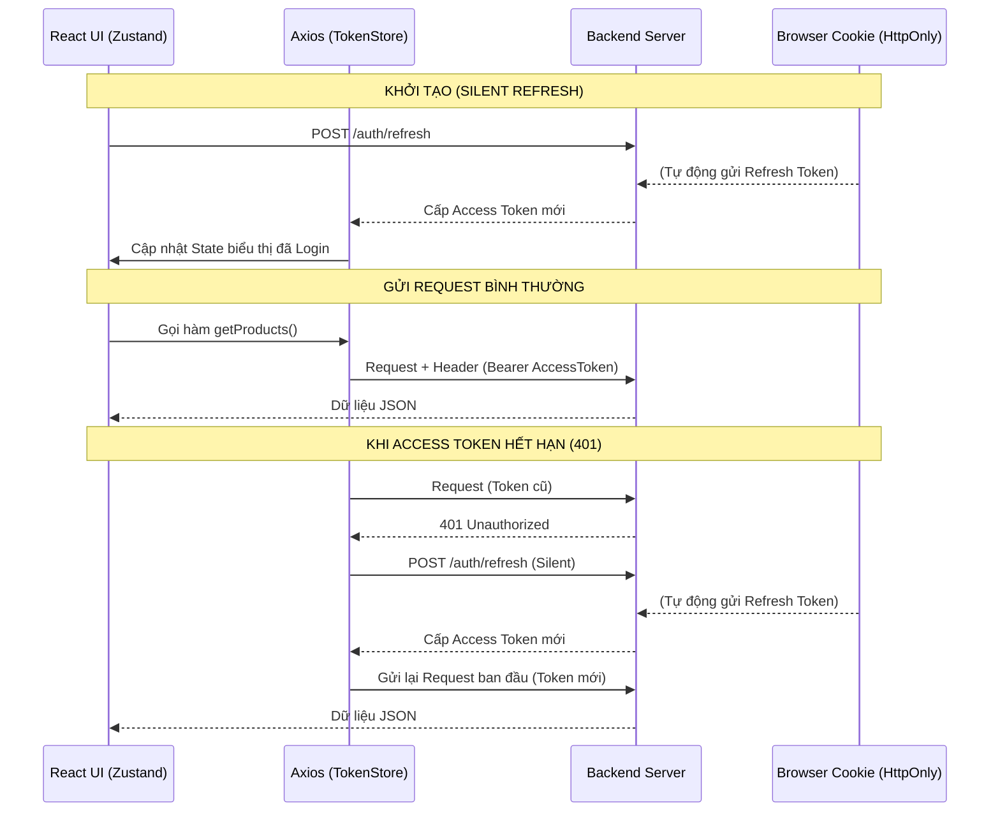

# Auth Flow Documentation

Tài liệu này giải thích cách hệ thống quản lý phiên đăng nhập, xử lý bảo mật và tự động gia hạn token.

## 1. Các thành phần lưu trữ

| Thành phần | Loại Token | Vị trí lưu trữ | Đặc điểm bảo mật |
| :--- | :--- | :--- | :--- |
| **Access Token** | JWT | **In-memory** (JS Variable & Zustand) | Không thể bị truy cập bởi mã độc XSS vì không nằm trong Storage. |
| **Refresh Token** | JWT | **HttpOnly Cookie** | Trình duyệt tự gửi đi, JS không thể đọc được. Chống XSS cực tốt. |

---

## 2. Các luồng hoạt động chính (Sequence Flows)

### A. Đăng nhập (Login Flow)
1. User gửi thông tin đăng nhập (Email/Password hoặc Google ID Token).
2. Server xác thực và trả về:
   - **Body JSON**: Chứa `accessToken`.
   - **Set-Cookie Header**: Chứa `refreshToken` (HttpOnly, Secure, SameSite=Strict).
3. Client gọi `setAuth(accessToken)`:
   - Lưu vào `tokenStore.ts` (để Axios sử dụng).
   - Lưu vào `useAuthStore.ts` (để React UI cập nhật).

### B. Khởi tạo ứng khi load trang (Silent Refresh Flow)
*Vì Access Token lưu trong bộ nhớ sẽ mất khi F5, luồng này giúp duy trì phiên:*
1. Ứng dụng load lần đầu, component `AuthInitializer` được mount.
2. `AuthInitializer` gọi API `POST /auth/refresh`.
3. Trình duyệt **tự động đính kèm** Refresh Token từ Cookie.
4. Server kiểm tra, nếu hợp lệ sẽ trả về `accessToken` mới.
5. Client cập nhật các Store và render ứng dụng ở trạng thái "Đã đăng nhập".

### C. Tự động làm mới khi Token hết hạn (401 Interceptor Flow)
1. Client gửi request với Access Token đã hết hạn.
2. Server trả về lỗi `401 Unauthorized`.
3. **Axios Interceptor** bắt được lỗi:
   - Tạm dừng các request khác (đưa vào hàng đợi).
   - Gọi API `/auth/refresh` để lấy token mới.
   - Nếu lấy thành công: Cập nhật Store và **thử lại (retry)** request bị lỗi ban đầu.
   - Nếu thất bại (Refresh Token cũng hết hạn): Gọi `clearAuth()` để logout.

---

## 3. Sơ đồ kiến trúc (Architecture Diagram)

---

## 4. Phân tích bảo mật
- **XSS (Cross-Site Scripting)**: An toàn tuyệt đối. Token không nằm trong `localStorage` nên các script lạ không thể lấy được.
- **CSRF (Cross-Site Request Forgery)**: Refresh Token trong Cookie được bảo vệ bởi cờ `SameSite=Strict/Lax` và Access Token chỉ được gửi qua Header (Header không bị tự động đính kèm khi bị tấn công CSRF).
- **Cleanup**: Khi đóng tab, Access Token biến mất. Khi đóng trình duyệt (tùy cấu hình cookie), Refresh Token cũng có thể biến mất.
