# Phân tích ERD — Vinyl Shop

## Quy ước chung

| Ký hiệu | Ý nghĩa |
|---|---|
| `PK` | Primary Key — khóa chính, định danh duy nhất mỗi dòng |
| `FK` | Foreign Key — tham chiếu sang bảng khác |
| `uuid` | Kiểu định danh duy nhất toàn cầu, an toàn hơn integer tăng dần |
| `enum` | Tập giá trị cố định, ví dụ `vinyl / cd / cassette` |
| `unique` | Không được trùng lặp trong toàn bảng |
| `nullable` | Cho phép để trống |

---

## Mục 1 — Vai trò người dùng

**Số entity: 1**

### `users` — Người dùng

Lưu thông tin tất cả người dùng đã đăng ký. Guest không có dòng trong DB — họ tồn tại ở tầng session/request, không phải tầng dữ liệu.

```
users
─────────────────────────────────────────
id            | uuid        PK
name          | string
email         | string      unique
password_hash | string      nullable    -- null nếu dùng Google Login
auth_provider | enum        -- local | google
provider_id   | string      nullable    -- ID từ Google (sub)
role          | enum        -- customer | admin
created_at    | timestamp
```

**Giải thích từng field:**

- `auth_provider` mặc định là `local`. Nếu dùng Google, `password_hash` sẽ để trống.
- `provider_id` lưu mã định danh duy nhất từ Google (subject) để tránh phụ thuộc hoàn toàn vào email (vốn có thể thay đổi).
- `role` chỉ có 2 giá trị vì Guest không tồn tại trong DB. Toàn bộ quyền hạn của Guest là "không có JWT" — xử lý ở tầng API, không phải schema.
- `password_hash` — lưu kết quả băm (bcrypt/argon2), không bao giờ lưu mật khẩu plaintext. Ngay cả admin cũng không thể đọc được mật khẩu thật.
- Không cần bảng `roles` hay `permissions` riêng vì hệ thống chỉ có 3 vai trò cố định, quyền hạn không thay đổi động. Thêm bảng là over-engineering.

**Quan hệ với các bảng khác:**

```
users ──< orders
users ──< wantlist_items
users ──< user_collections
users ──< ai_conversations
users ──< curated_collections (admin tạo)
users ──| carts (1-1)
```

---

## Mục 2 — Catalog âm nhạc

**Số entity: 6 + 2 junction table = 8 bảng**

Catalog là kho dữ liệu âm nhạc thuần túy — tách biệt hoàn toàn khỏi logic mua bán. Đây là nền tảng để AI hoạt động và quản lý thông tin sản phẩm chính xác.

Phân cấp dữ liệu:

```
Artist → Release → ReleaseVersion → Product (mục 3)
                └→ Track
Label  → ReleaseVersion
Genre  ↔ Artist (nhiều-nhiều)
Genre  ↔ Release (nhiều-nhiều)
```

---

### `artists` — Nghệ sĩ

Lưu thông tin về người/nhóm nhạc. Một artist có thể có nhiều album, nhiều thể loại.

```
artists
─────────────────────────────────────────
id        | uuid     PK
name      | string               -- "Pink Floyd", "Miles Davis"
bio       | text                 -- tiểu sử dài, dùng text thay string
country   | string               -- "UK", "US" — dùng để lọc sản phẩm
image_url | string   nullable    -- lưu đường dẫn, không lưu file vào DB
```

**Giải thích:**

- `bio` dùng kiểu `text` thay vì `string` (varchar) vì tiểu sử có thể rất dài, không nên giới hạn độ dài.
- `image_url` lưu đường dẫn đến file ảnh (S3, CDN...). DB không lưu binary file vì làm tăng kích thước DB, backup chậm, query nặng.
- `country` lưu trực tiếp thay vì tách thành bảng `countries` vì không có nghiệp vụ quản lý danh sách quốc gia — chỉ dùng để lọc.

---

### `genres` — Thể loại nhạc

Danh sách chuẩn hóa các thể loại nhạc. Tách ra thành bảng riêng để tránh typo và dễ quản lý tập trung.

```
genres
─────────────────────────────────────────
id   | uuid     PK
name | string   unique    -- "Progressive Rock" — tên hiển thị
slug | string   unique    -- "progressive-rock" — dùng cho URL và filter
```

**Giải thích:**

- `name` phải `unique` để tránh "Rock" và "rock" tồn tại song song.
- `slug` là phiên bản URL-safe của name — không dấu cách, không ký tự đặc biệt. Dùng khi filter `/products?genre=progressive-rock`. Frontend không cần encode khoảng trắng.
- Lý do tách bảng riêng thay vì lưu thẳng vào `artists`: nếu lưu thẳng `genres = "Rock"` vào `artists`, khi muốn đổi tên genre hoặc thêm slug, phải update tất cả các dòng liên quan. Tách ra thì chỉ update 1 dòng trong `genres`.

---

### `releases` — Bản phát hành gốc

Thông tin nghệ thuật của một album/EP/single. Đây là "bản gốc" — chưa quan tâm ép ở đâu, năm nào, hãng nào.

```
releases
─────────────────────────────────────────
id        | uuid     PK
artist_id | uuid     FK → artists.id
title     | string               -- "Dark Side of the Moon"
year      | int                  -- 1973 — năm phát hành gốc
cover_url | string   nullable    -- ảnh bìa gốc
```

**Giải thích:**

- `year` là năm phát hành gốc, không phải năm ép lại. Năm ép lại nằm ở `release_versions.pressing_year`.
- Tại sao tách `releases` khỏi `release_versions`? Một album có thể có hàng chục lần ép lại ở nhiều quốc gia. Nếu gộp chung, thông tin nghệ thuật (tên, năm, tracklist) bị lặp lại hàng chục lần. Tách ra thì thông tin nghệ thuật lưu một lần, các phiên bản ép chỉ lưu thông tin vật lý.

---

### `release_versions` — Phiên bản cụ thể

Mỗi lần album được ép ra là một `release_version` riêng. Đây là thực thể trực tiếp liên kết sang `products`.

```
release_versions
─────────────────────────────────────────
id               | uuid     PK
release_id       | uuid     FK → releases.id
label_id         | uuid     FK → labels.id
pressing_country | string               -- "US", "Japan", "UK"
catalog_number   | string               -- "SHVL 804" — mã của hãng đĩa
pressing_year    | int                  -- 1973, 1976, 2011
format           | enum                 -- vinyl | cd | cassette
notes            | text     nullable    -- "First UK pressing", "OBI strip"
```

**Giải thích:**

- `catalog_number` là mã định danh do hãng đĩa đặt, dùng để tra cứu và xác thực đĩa thật/giả. Quan trọng với collectors.
- `format` nằm ở đây vì định dạng là thuộc tính của lần ép — Japan OBI 1976 xác định đó là Vinyl, không phải CD. Đây là source of truth cho format.
- `notes` dùng text tự do thay vì enum vì các đặc điểm phiên bản rất đa dạng và khó liệt kê hết trước.

**Ví dụ thực tế — cùng 1 release, 3 version:**

| pressing_country | pressing_year | label | notes |
|---|---|---|---|
| US | 1973 | Harvest | First US pressing |
| Japan | 1976 | Toshiba EMI | OBI strip |
| UK | 2011 | Parlophone | 2011 Remaster |

Ba dòng trong `release_versions`, chỉ 1 dòng trong `releases`.

---

### `labels` — Hãng đĩa

Công ty phát hành đĩa. Một hãng có thể phát hành nhiều phiên bản của nhiều album khác nhau.

```
labels
─────────────────────────────────────────
id           | uuid     PK
name         | string               -- "Harvest Records", "Toshiba EMI"
country      | string               -- "UK", "Japan"
founded_year | int      nullable
website      | string   nullable
```

**Giải thích:**

- Tại sao `labels` là entity riêng thay vì lưu thẳng tên hãng vào `release_versions`? Vì nhiều `release_versions` dùng chung một hãng đĩa. "Harvest Records" phát hành hàng trăm album. Nếu lưu thẳng tên hãng, khi cần thêm thông tin về hãng (website, country) phải update hàng trăm dòng. Tách ra thì chỉ update 1 dòng trong `labels`.

---

### `tracks` — Danh sách bài hát

Tracklist của một album. Gắn vào `releases` — không gắn vào `release_versions` vì các bản ép khác nhau vẫn có cùng tracklist gốc.

```
tracks
─────────────────────────────────────────
id               | uuid     PK
release_id       | uuid     FK → releases.id
position         | int                  -- thứ tự bài: 1, 2, 3...
title            | string               -- "Speak to Me", "Breathe"
duration_seconds | int                  -- 168
side             | string   nullable    -- "A", "B" — dành cho vinyl
```

**Giải thích:**

- `duration_seconds` lưu số nguyên thay vì chuỗi `"3:20"` vì dễ tính tổng thời lượng album, sort, filter. Hiển thị `"3:20"` là việc của frontend — `Math.floor(168/60) + ":" + (168%60)`.
- `side` dùng cho vinyl có mặt A và mặt B. Track 1-6 mặt A, track 7-12 mặt B. CD và cassette thì `side = null`.
- Tại sao gắn vào `releases` thay vì `release_versions`? Vì tracklist là thông tin nghệ thuật, không thay đổi theo lần ép. Japan OBI 1976 và US First Press 1973 đều có cùng tracklist.

---

### Junction table: `artist_genres`

Nối `artists` và `genres` theo quan hệ nhiều-nhiều. Một artist có nhiều genres, một genre có nhiều artists.

```
artist_genres
─────────────────────────────────────────
artist_id | uuid     FK → artists.id
genre_id  | uuid     FK → genres.id
─────────────────────────────────────────
PRIMARY KEY (artist_id, genre_id)         -- composite key, không cần id riêng
```

**Ví dụ:**

| artist_id | genre_id |
|---|---|
| pink-floyd-id | progressive-rock-id |
| pink-floyd-id | psychedelic-rock-id |
| miles-davis-id | jazz-id |

---

### Junction table: `release_genres`

Nối `releases` và `genres`. Tách riêng khỏi `artist_genres` vì một release đôi khi có thể thuộc genre khác với artist.

```
release_genres
─────────────────────────────────────────
release_id | uuid     FK → releases.id
genre_id   | uuid     FK → genres.id
─────────────────────────────────────────
PRIMARY KEY (release_id, genre_id)
```

**Tại sao tách riêng khỏi `artist_genres`?**

Miles Davis là Jazz, nhưng album *Bitches Brew* thuộc Jazz Fusion — genre riêng của release đó, không đại diện cho toàn bộ artist. Nếu gộp chung, không thể phân biệt "genre của artist" và "genre của album cụ thể này".

---

## Mục 3 — Sản phẩm & Bán hàng

**Số entity: 7 (bao gồm 1 junction table + 3 bảng attribute)**

Mục này là cầu nối giữa catalog âm nhạc và hệ thống bán hàng.

```
release_versions → products → product_variants
                                    ↑
                          (giá và tồn kho nằm ở đây)
```

---

### `products` — Sản phẩm

Một `product` đại diện cho một `release_version` mà shop đang kinh doanh. Không phải mọi `release_version` đều được bán — chỉ những bản admin chủ động tạo product mới xuất hiện trong shop.

```
products
─────────────────────────────────────────
id                   | uuid     PK
release_version_id   | uuid     FK → release_versions.id
name                 | string               -- tên hiển thị trong shop
description          | text     nullable
format               | enum                 -- vinyl | cd | cassette (denormalize từ release_version để query nhanh)
is_limited           | boolean  default false
limited_qty          | int      nullable    -- chỉ có giá trị khi is_limited = true
is_preorder          | boolean  default false
preorder_release_date| date     nullable    -- chỉ có giá trị khi is_preorder = true
is_active            | boolean  default true
created_at           | timestamp
```

**Giải thích:**

- `format` được denormalize (copy lại) từ `release_version.format` để tránh join 3 tầng mỗi khi filter sản phẩm theo định dạng. `release_version.format` vẫn là source of truth — nếu thay đổi, cần sync lại.
- `is_limited + limited_qty`: khi `is_limited = true`, `limited_qty` là số lượng tối đa từng phát hành. Nghiệp vụ yêu cầu không được tăng `limited_qty` sau khi bắt đầu bán — enforce ở tầng service, không phải DB constraint.
- `is_preorder + preorder_release_date`: khi `is_preorder = true`, tồn kho không bị trừ cho đến ngày `preorder_release_date`. Logic này xử lý ở tầng service khi checkout.
- `is_active = false` dùng khi ẩn sản phẩm thay vì xóa — không được xóa khi đang có đơn hàng Pending/Confirmed.

---

### `product_variants` — Biến thể sản phẩm

Mỗi product có thể có nhiều biến thể. **Giá và tồn kho nằm ở variant, không phải product.** Bảng này chỉ lưu phần chung — thuộc tính riêng của từng format được tách sang 3 bảng extension bên dưới.

```
product_variants
─────────────────────────────────────────
id           | uuid     PK
product_id   | uuid     FK → products.id
variant_name | string               -- "Black 180g Gatefold", "Japan Deluxe Edition"
price        | decimal              -- giá của biến thể này
stock_qty    | int      default 0
is_available | boolean  default true
is_signed    | boolean  default false   -- chung cho cả 3 format
```

**Giải thích:**

- 3 bảng extension riêng cho từng format (`vinyl_attributes`, `cd_attributes`, `cassette_attributes`). Lý do: thuộc tính của mỗi format là **cố định và đã biết trước**, tách bảng giúp DB tự enforce kiểu dữ liệu và enum, schema self-documenting, query có index cụ thể thay vì scan JSON.
- `is_signed` nằm ở đây vì là thuộc tính chung cho cả 3 format — vinyl, CD, cassette đều có thể có chữ ký nghệ sĩ.
- `is_available` tự động chuyển về `false` khi `stock_qty = 0` — xử lý ở tầng service hoặc DB trigger.

**Quan hệ với bảng extension (1-1):**

```
product_variants ──| vinyl_attributes
product_variants ──| cd_attributes
product_variants ──| cassette_attributes
```

Một variant chỉ thuộc đúng 1 format nên chỉ có đúng 1 bảng extension tương ứng tồn tại. Biết variant thuộc format nào thông qua `products.format`.

---

### `vinyl_attributes` — Thuộc tính biến thể Vinyl

```
vinyl_attributes
─────────────────────────────────────────
id                 | uuid   PK
product_variant_id | uuid   FK → product_variants.id   unique
disc_color         | enum   -- black | colored | splatter | picture_disc
weight_grams       | enum   -- 140 | 180
speed_rpm          | enum   -- 33 | 45
disc_count         | enum   -- 1lp | 2lp | box_set
sleeve_type        | enum   -- standard | gatefold | obi_strip
```

**Giải thích:**

- `unique` trên `product_variant_id` enforce quan hệ 1-1 — một variant không thể có 2 dòng vinyl_attributes.
- Tất cả dùng `enum` thay vì `string` tự do để DB từ chối giá trị không hợp lệ. Không thể lưu `weight_grams = "180g"` (string) hay `speed_rpm = 78` (không hợp lệ).
- `disc_count` phân biệt 1LP, 2LP, Box set — mỗi loại có giá và tồn kho riêng nên là variant khác nhau.

**Ví dụ biến thể Vinyl của 1 product:**

| variant_name | disc_color | weight_grams | speed_rpm | sleeve_type | price | stock_qty |
|---|---|---|---|---|---|---|
| Black 140g Standard | black | 140 | 33 | standard | 1.200.000 | 15 |
| Blue 180g Gatefold | colored | 180 | 33 | gatefold | 1.800.000 | 3 |
| Picture Disc | picture_disc | 140 | 33 | standard | 2.500.000 | 1 |

---

### `cd_attributes` — Thuộc tính biến thể CD

```
cd_attributes
─────────────────────────────────────────
id                 | uuid    PK
product_variant_id | uuid    FK → product_variants.id   unique
edition            | enum    -- standard | deluxe | box_set
is_japan_edition   | boolean default false    -- Japan edition thường có bonus track riêng
```

**Giải thích:**

- `edition` phân biệt Standard (tracklist gốc) và Deluxe/Expanded (có bonus tracks) — hai biến thể khác nhau về nội dung, không chỉ về vỏ hộp.
- `is_japan_edition` tách riêng thành boolean vì Japan edition là khái niệm đặc thù trong thị trường đĩa nhạc — thường có bonus track độc quyền, OBI strip, giá cao hơn, và được collectors săn đón riêng.

---

### `cassette_attributes` — Thuộc tính biến thể Cassette

```
cassette_attributes
─────────────────────────────────────────
id                 | uuid   PK
product_variant_id | uuid   FK → product_variants.id   unique
tape_color         | enum   -- black | clear | white | colored
edition            | enum   -- standard | limited
```

**Giải thích:**

- `tape_color` là thuộc tính thị giác quan trọng với cassette collectors — màu băng ảnh hưởng trực tiếp đến giá và tính hiếm.
- `edition = limited` kết hợp với `products.is_limited` để double-check: `is_limited` là nghiệp vụ (giới hạn số lượng bán), `edition` là thông tin marketing của nhà sản xuất.

---

### `curated_collections` — Bộ sưu tập chủ đề

Admin tạo các bộ sưu tập biên tập để nhóm sản phẩm theo chủ đề. Ví dụ: *Horror Soundtracks*, *Vietnam New Wave*.

```
curated_collections
─────────────────────────────────────────
id           | uuid     PK
created_by   | uuid     FK → users.id    -- phải là admin
title        | string                    -- "Horror Soundtracks"
description  | text     nullable
is_published | boolean  default false    -- draft trước khi publish
created_at   | timestamp
```

**Giải thích:**

- `is_published` cho phép admin soạn bộ sưu tập trước rồi publish khi sẵn sàng, thay vì hiển thị ngay khi tạo.
- `created_by` ghi nhận admin nào tạo, dùng cho audit log.

---

### Junction table: `curated_collection_items`

Nối `curated_collections` và `products`. Một collection có nhiều products, một product có thể xuất hiện trong nhiều collections.

```
curated_collection_items
─────────────────────────────────────────
id            | uuid     PK
collection_id | uuid     FK → curated_collections.id
product_id    | uuid     FK → products.id
sort_order    | int                  -- thứ tự hiển thị trong collection
```

**Giải thích:**

- Dùng `id` riêng thay vì composite key vì có thêm `sort_order` — composite key không thể mô tả thứ tự.
- `sort_order` cho phép admin sắp xếp sản phẩm trong collection theo ý muốn, không phụ thuộc vào thứ tự insert.

---

## Mục 4 — Quy trình đơn hàng

**Số entity: 5**

Vòng đời đơn hàng:

```
Pending → Confirmed → Shipped → Delivered → Completed
             ↓
          Cancelled
```

---

### `carts` — Giỏ hàng

Mỗi customer có đúng 1 giỏ hàng. Giỏ hàng tồn tại persistent (không mất khi đóng tab).

```
carts
─────────────────────────────────────────
id         | uuid     PK
user_id    | uuid     FK → users.id    unique    -- 1 user chỉ có 1 cart
updated_at | timestamp
```

**Giải thích:**

- `user_id` có constraint `unique` để đảm bảo 1 user chỉ có đúng 1 giỏ hàng.
- Không lưu `total` vào `carts` vì tổng tiền luôn được tính động từ `cart_items` — tránh dữ liệu lệch nhau khi giá thay đổi.
- Guest không có cart trong DB — nếu cần, lưu tạm ở localStorage phía frontend.

---

### `cart_items` — Sản phẩm trong giỏ

```
cart_items
─────────────────────────────────────────
id                 | uuid     PK
cart_id            | uuid     FK → carts.id
product_variant_id | uuid     FK → product_variants.id
quantity           | int      default 1
```

**Giải thích:**

- Gắn vào `product_variant_id` thay vì `product_id` vì user chọn cụ thể biến thể nào (màu đĩa, trọng lượng...).
- Không lưu `price` vào `cart_items` — giá lấy real-time từ `product_variants.price` khi hiển thị giỏ hàng. Giá chỉ được chốt (snapshot) khi tạo `order_items`.

---

### `orders` — Đơn hàng

```
orders
─────────────────────────────────────────
id               | uuid     PK
user_id          | uuid     FK → users.id
status           | enum               -- pending | confirmed | shipped | delivered | completed | cancelled
shipping_address | string             -- địa chỉ giao hàng (snapshot lúc đặt)
recipient_name   | string             -- tên người nhận (snapshot)
phone            | string             -- số điện thoại (snapshot)
total_amount     | decimal            -- tổng tiền (snapshot lúc đặt)
tracking_number  | string  nullable   -- mã vận chuyển, có sau khi shipped
cancelled_by     | uuid    nullable   FK → users.id   -- ai hủy đơn
cancel_reason    | text    nullable
created_at       | timestamp
updated_at       | timestamp
```

**Giải thích:**

- `shipping_address`, `recipient_name`, `phone` là snapshot — copy từ profile user lúc đặt hàng. Nếu sau này user đổi địa chỉ, đơn hàng cũ không bị ảnh hưởng.
- `total_amount` cũng là snapshot — tổng tiền tại thời điểm đặt. Không tính lại từ `order_items` sau này vì giá có thể đã thay đổi.
- `cancelled_by` ghi nhận ai hủy — customer hay admin — phục vụ audit log và báo cáo.
- `tracking_number` chỉ có giá trị sau khi đơn chuyển sang trạng thái `shipped`.

**Nghiệp vụ hủy đơn:**

| Trạng thái | Customer | Admin |
|---|---|---|
| Pending | Được hủy | Được hủy |
| Confirmed trở đi | Không được | Được hủy |

---

### `order_items` — Chi tiết đơn hàng

```
order_items
─────────────────────────────────────────
id                 | uuid     PK
order_id           | uuid     FK → orders.id
product_variant_id | uuid     FK → product_variants.id
quantity           | int
unit_price         | decimal              -- snapshot giá lúc đặt
```

**Giải thích:**

- `unit_price` là snapshot giá tại thời điểm đặt hàng — không lấy lại từ `product_variants.price`. Nếu sau này admin thay đổi giá, đơn hàng cũ phản ánh đúng giá khách đã trả.
- `product_variant_id` vẫn giữ FK dù là snapshot — để có thể tra cứu thông tin sản phẩm (tên, ảnh) khi hiển thị lịch sử đơn hàng.

---


## Mục 5 — Thanh toán

**Số entity: 1**

### `payments` — Thanh toán

Mỗi đơn hàng có đúng 1 lần thanh toán (quan hệ 1-1 với `orders`).

```
payments
─────────────────────────────────────────
id               | uuid     PK
order_id         | uuid     FK → orders.id    unique    -- 1 đơn chỉ có 1 payment
method           | enum               -- vnpay | cod
amount           | decimal            -- số tiền thanh toán
transaction_code | string  nullable   -- mã giao dịch từ VNPAY, null nếu COD
status           | enum               -- pending | success | failed
paid_at          | timestamp nullable -- thời điểm thanh toán thành công
```

**Giải thích:**

- `order_id unique` enforce quan hệ 1-1 — 1 đơn không thể có 2 payment records.
- `transaction_code` null khi COD vì không có mã giao dịch ngân hàng.
- `paid_at` null khi COD pending (chưa giao hàng) hoặc VNPAY failed. Chỉ có giá trị khi `status = success`.
- `status = pending` cho COD nghĩa là đã đặt hàng nhưng chưa thu tiền mặt. Chỉ chuyển sang `success` sau khi giao hàng thành công.

**Flow thanh toán:**

```
VNPAY:  Tạo payment (pending) → redirect VNPAY → callback → success/failed
COD:    Tạo payment (pending) → giao hàng → thu tiền → success
```

---

## Mục 6 — Wantlist & Collection

**Số entity: 2**

---

### `wantlist_items` — Danh sách muốn mua

Sản phẩm khách muốn mua nhưng chưa mua (hoặc đang hết hàng).

```
wantlist_items
─────────────────────────────────────────
id               | uuid     PK
user_id          | uuid     FK → users.id
product_id       | uuid     FK → products.id
added_at         | timestamp
last_notified_at | timestamp nullable    -- lần cuối gửi thông báo hàng về
─────────────────────────────────────────
UNIQUE (user_id, product_id)            -- không thêm trùng
```

**Giải thích:**

- `last_notified_at` xử lý nghiệp vụ **không thông báo lại trong vòng 7 ngày**: khi hàng về, hệ thống check `last_notified_at`. Nếu `null` hoặc đã quá 7 ngày → gửi thông báo và update `last_notified_at = NOW()`.
- Gắn với `product_id` (không phải `product_variant_id`) — khách quan tâm đến album, không phải cụ thể màu đĩa nào.

---

### `user_collections` — Bộ sưu tập cá nhân

Sản phẩm khách đã sở hữu (không nhất thiết phải mua tại shop).

```
user_collections
─────────────────────────────────────────
id         | uuid     PK
user_id    | uuid     FK → users.id
product_id | uuid     FK → products.id
added_at   | timestamp
─────────────────────────────────────────
UNIQUE (user_id, product_id)
```

**Giải thích:**

- `user_collections` được dùng bởi hệ thống gợi ý: **không gợi ý sản phẩm đã có trong Collection** của khách hàng.
- Khách có thể tự thêm vào collection dù không mua tại shop — vì họ có thể đã sở hữu đĩa từ trước.

---

## Mục 7 — Tính năng AI

**Số entity: 3**

---

### `ai_conversations` — Phiên hội thoại AI

Mỗi phiên chat là một conversation. Guest và Customer đều có conversation, nhưng khác nhau ở thời hạn lưu trữ.

```
ai_conversations
─────────────────────────────────────────
id             | uuid     PK
user_id        | uuid     FK → users.id    nullable    -- null nếu là Guest
session_token  | string   nullable                     -- định danh Guest session
expires_at     | timestamp nullable                    -- null = lưu vĩnh viễn (Customer)
                                                       -- có giá trị = Guest (30 phút)
last_active_at | timestamp
started_at     | timestamp
```

**Giải thích:**

- `user_id` nullable vì Guest không có tài khoản. Với Guest, dùng `session_token` để định danh.
- `expires_at = null` → Customer, lưu vĩnh viễn.
- `expires_at = started_at + 30 phút` → Guest, tự động xóa sau 30 phút không hoạt động.
- `last_active_at` dùng để tính "30 phút không hoạt động" — mỗi khi có tin nhắn mới, update field này.

---

### `ai_messages` — Tin nhắn trong hội thoại

```
ai_messages
─────────────────────────────────────────
id              | uuid     PK
conversation_id | uuid     FK → ai_conversations.id
role            | enum               -- user | assistant
content         | text               -- nội dung tin nhắn
created_at      | timestamp
```

**Giải thích:**

- `role` phân biệt tin nhắn của người dùng (`user`) và phản hồi của AI (`assistant`). Khi gọi AI API, toàn bộ lịch sử được gửi kèm theo thứ tự này.
- `content` là text thuần — không lưu HTML hay markdown đã render, để frontend tự quyết định cách hiển thị.

---

### `recommendations` — Gợi ý sản phẩm cá nhân hóa

Kết quả gợi ý được tính toán trước và lưu cache, làm mới mỗi 24 giờ hoặc khi có hoạt động mới.

```
recommendations
─────────────────────────────────────────
id                 | uuid     PK
user_id            | uuid     FK → users.id
product_variant_id | uuid     FK → product_variants.id
score              | float              -- điểm ưu tiên, dùng để sort
generated_at       | timestamp
expires_at         | timestamp          -- thường là generated_at + 24h
```

**Giải thích:**

- `score` cho phép sắp xếp gợi ý theo độ phù hợp — sản phẩm có `score` cao hơn hiển thị trước.
- `expires_at` xử lý nghiệp vụ làm mới mỗi 24 giờ: một background job chạy định kỳ xóa các record hết hạn và tính lại.
- **Điều kiện kích hoạt** (enforce ở tầng service, không phải DB): chỉ tính gợi ý cho user có ít nhất 1 đơn hoàn thành hoặc 3 sản phẩm trong Wantlist.
- **Quy tắc lọc** (enforce ở tầng service): không gợi ý sản phẩm đã có trong `user_collections`, không gợi ý sản phẩm `stock_qty = 0`.

---

## Mục 8 — Thông báo & Sự kiện nghiệp vụ

**Số entity: 1**

Email notification là side effect của các sự kiện nghiệp vụ, không phải luồng chính. Cần một bảng log để theo dõi trạng thái gửi.

### `notification_logs` — Lịch sử thông báo

```
notification_logs
─────────────────────────────────────────
id           | uuid     PK
user_id      | uuid     FK → users.id
type         | enum               -- order_created | order_confirmed | order_shipped
                                  -- order_completed | order_cancelled | wantlist_restock
reference_id | uuid               -- id của order hoặc wantlist_item liên quan
channel      | enum               -- email (có thể mở rộng thêm push, sms sau)
status       | enum               -- pending | sent | failed
sent_at      | timestamp nullable
error_msg    | text     nullable   -- lưu lý do thất bại nếu có
created_at   | timestamp
```

**Giải thích:**

- `type` mapping với 6 sự kiện trong BRD: tạo đơn, xác nhận đơn, ship đơn, hoàn thành đơn, hủy đơn, hàng wantlist về.
- `reference_id` liên kết với entity liên quan — có thể là `order_id` hoặc `wantlist_item_id`. Không tạo FK cứng vì `reference_id` trỏ đến nhiều bảng khác nhau tùy `type`.
- `status` + `error_msg` cho phép retry khi gửi email thất bại và debug lỗi.
- Bảng này đồng thời xử lý nghiệp vụ Wantlist: thay vì chỉ dựa vào `wantlist_items.last_notified_at`, có thể tra cứu lịch sử đầy đủ các lần đã thông báo.

---

## Tổng kết toàn bộ ERD

### Danh sách bảng

| # | Bảng | Mục | Mô tả |
|---|---|---|---|
| 1 | `users` | 1 | Người dùng |
| 2 | `artists` | 2 | Nghệ sĩ |
| 3 | `genres` | 2 | Thể loại nhạc |
| 4 | `releases` | 2 | Bản phát hành gốc |
| 5 | `release_versions` | 2 | Phiên bản cụ thể |
| 6 | `labels` | 2 | Hãng đĩa |
| 7 | `tracks` | 2 | Danh sách bài hát |
| 8 | `artist_genres` | 2 | Junction: artist ↔ genre |
| 9 | `release_genres` | 2 | Junction: release ↔ genre |
| 10 | `products` | 3 | Sản phẩm |
| 11 | `product_variants` | 3 | Biến thể sản phẩm (phần chung) |
| 12 | `vinyl_attributes` | 3 | Thuộc tính biến thể Vinyl |
| 13 | `cd_attributes` | 3 | Thuộc tính biến thể CD |
| 14 | `cassette_attributes` | 3 | Thuộc tính biến thể Cassette |
| 15 | `curated_collections` | 3 | Bộ sưu tập chủ đề |
| 16 | `curated_collection_items` | 3 | Junction: collection ↔ product |
| 17 | `carts` | 4 | Giỏ hàng |
| 18 | `cart_items` | 4 | Sản phẩm trong giỏ |
| 19 | `orders` | 4 | Đơn hàng |
| 20 | `order_items` | 4 | Chi tiết đơn hàng |

| 22 | `payments` | 5 | Thanh toán |
| 23 | `wantlist_items` | 6 | Danh sách muốn mua |
| 24 | `user_collections` | 6 | Bộ sưu tập cá nhân |
| 25 | `ai_conversations` | 7 | Phiên hội thoại AI |
| 26 | `ai_messages` | 7 | Tin nhắn AI |
| 27 | `recommendations` | 7 | Gợi ý cá nhân hóa |
| 28 | `notification_logs` | 8 | Lịch sử thông báo |

**Tổng: 28 bảng**

---

### Sơ đồ quan hệ tổng thể

```mermaid
erDiagram

  %% ─── MỤC 1: AUTH ───
  users {
    uuid id PK
    string name
    string email
    string password_hash
    enum role "customer | admin"
    timestamp created_at
  }

  %% ─── MỤC 2: CATALOG ───
  artists {
    uuid id PK
    string name
    text bio
    string country
    string image_url
  }
  genres {
    uuid id PK
    string name
    string slug
  }
  artist_genres {
    uuid artist_id FK
    uuid genre_id FK
  }
  releases {
    uuid id PK
    uuid artist_id FK
    string title
    int year
    string cover_url
  }
  release_genres {
    uuid release_id FK
    uuid genre_id FK
  }
  labels {
    uuid id PK
    string name
    string country
    int founded_year
    string website
  }
  release_versions {
    uuid id PK
    uuid release_id FK
    uuid label_id FK
    string pressing_country
    string catalog_number
    int pressing_year
    enum format "vinyl | cd | cassette"
    text notes
  }
  tracks {
    uuid id PK
    uuid release_id FK
    int position
    string title
    int duration_seconds
    string side
  }

  %% ─── MỤC 3: SẢN PHẨM ───
  products {
    uuid id PK
    uuid release_version_id FK
    string name
    text description
    enum format "vinyl | cd | cassette"
    boolean is_limited
    int limited_qty
    boolean is_preorder
    date preorder_release_date
    boolean is_active
    timestamp created_at
  }
  product_variants {
    uuid id PK
    uuid product_id FK
    string variant_name
    decimal price
    int stock_qty
    boolean is_available
    boolean is_signed
  }
  vinyl_attributes {
    uuid id PK
    uuid product_variant_id FK
    enum disc_color "black | colored | splatter | picture_disc"
    enum weight_grams "140 | 180"
    enum speed_rpm "33 | 45"
    enum disc_count "1lp | 2lp | box_set"
    enum sleeve_type "standard | gatefold | obi_strip"
  }
  cd_attributes {
    uuid id PK
    uuid product_variant_id FK
    enum edition "standard | deluxe | box_set"
    boolean is_japan_edition
  }
  cassette_attributes {
    uuid id PK
    uuid product_variant_id FK
    enum tape_color "black | clear | white | colored"
    enum edition "standard | limited"
  }
  curated_collections {
    uuid id PK
    uuid created_by FK
    string title
    text description
    boolean is_published
    timestamp created_at
  }
  curated_collection_items {
    uuid id PK
    uuid collection_id FK
    uuid product_id FK
    int sort_order
  }

  %% ─── MỤC 4: ĐƠN HÀNG ───
  carts {
    uuid id PK
    uuid user_id FK
    timestamp updated_at
  }
  cart_items {
    uuid id PK
    uuid cart_id FK
    uuid product_variant_id FK
    int quantity
  }
  orders {
    uuid id PK
    uuid user_id FK
    enum status "pending | confirmed | shipped | delivered | completed | cancelled"
    string shipping_address
    string recipient_name
    string phone
    decimal total_amount
    string tracking_number
    uuid cancelled_by FK
    text cancel_reason
    timestamp created_at
    timestamp updated_at
  }
  order_items {
    uuid id PK
    uuid order_id FK
    uuid product_variant_id FK
    int quantity
    decimal unit_price
  }

  %% ─── MỤC 5: THANH TOÁN ───
  payments {
    uuid id PK
    uuid order_id FK
    enum method "vnpay | cod"
    decimal amount
    string transaction_code
    enum status "pending | success | failed"
    timestamp paid_at
  }

  %% ─── MỤC 6: WANTLIST & COLLECTION ───
  wantlist_items {
    uuid id PK
    uuid user_id FK
    uuid product_id FK
    timestamp added_at
    timestamp last_notified_at
  }
  user_collections {
    uuid id PK
    uuid user_id FK
    uuid product_id FK
    timestamp added_at
  }

  %% ─── MỤC 7: AI ───
  ai_conversations {
    uuid id PK
    uuid user_id FK
    string session_token
    timestamp expires_at
    timestamp last_active_at
    timestamp started_at
  }
  ai_messages {
    uuid id PK
    uuid conversation_id FK
    enum role "user | assistant"
    text content
    timestamp created_at
  }
  recommendations {
    uuid id PK
    uuid user_id FK
    uuid product_variant_id FK
    float score
    timestamp generated_at
    timestamp expires_at
  }

  %% ─── MỤC 8: THÔNG BÁO ───
  notification_logs {
    uuid id PK
    uuid user_id FK
    enum type "order_created | order_confirmed | order_shipped | order_completed | order_cancelled | wantlist_restock"
    uuid reference_id
    enum channel "email"
    enum status "pending | sent | failed"
    timestamp sent_at
    text error_msg
    timestamp created_at
  }

  %% ─── QUAN HỆ ───
  artists ||--o{ artist_genres : "có"
  genres  ||--o{ artist_genres : "thuộc"
  artists ||--o{ releases : "phát hành"
  releases ||--o{ release_genres : "có"
  genres   ||--o{ release_genres : "thuộc"
  releases ||--o{ tracks : "chứa"
  releases ||--o{ release_versions : "có phiên bản"
  labels   ||--o{ release_versions : "phát hành"

  release_versions ||--o{ products : "là nền tảng"
  products ||--o{ product_variants : "có biến thể"
  product_variants ||--o| vinyl_attributes : "thuộc tính"
  product_variants ||--o| cd_attributes : "thuộc tính"
  product_variants ||--o| cassette_attributes : "thuộc tính"
  users ||--o{ curated_collections : "tạo"
  curated_collections ||--o{ curated_collection_items : "chứa"
  products ||--o{ curated_collection_items : "thuộc"

  users ||--o| carts : "có"
  carts ||--o{ cart_items : "chứa"
  product_variants ||--o{ cart_items : "trong giỏ"

  users ||--o{ orders : "đặt"
  orders ||--o{ order_items : "chứa"
  product_variants ||--o{ order_items : "trong đơn"
  orders ||--|| payments : "có"


  users ||--o{ wantlist_items : "muốn"
  products ||--o{ wantlist_items : "trong wantlist"
  users ||--o{ user_collections : "sở hữu"
  products ||--o{ user_collections : "trong collection"

  users ||--o{ ai_conversations : "có"
  ai_conversations ||--o{ ai_messages : "chứa"
  users ||--o{ recommendations : "nhận"
  product_variants ||--o{ recommendations : "được gợi ý"

  users ||--o{ notification_logs : "nhận thông báo"
```



---

### Các nghiệp vụ enforce ở tầng application

Những quy tắc này không thể model thuần trong DB schema, cần xử lý ở service layer:

| Nghiệp vụ | Xử lý ở đâu |
|---|---|
| Không xóa product khi đơn đang Pending/Confirmed | Service layer check trước khi delete |
| `limited_qty` không được tăng sau khi bắt đầu bán | Validation trong Admin API |
| Chỉ Admin hủy đơn từ Confirmed trở đi | Authorization middleware |
| Tồn kho pre-order không trừ trước ngày phát hành | Checkout service check `is_preorder + preorder_release_date` |

| Không gợi ý sản phẩm đã có trong Collection | Query filter trong recommendation service |
| Không gợi ý sản phẩm hết hàng | Query filter `stock_qty > 0` |
| Wantlist không thông báo lại trong 7 ngày | Check `last_notified_at` trong notification service |
| Guest chat mất sau 30 phút không hoạt động | Background job xóa conversation hết hạn |
